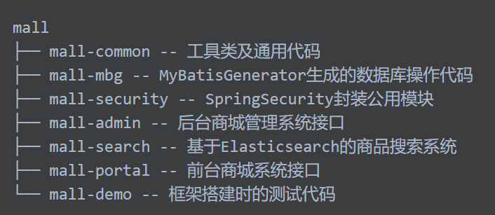
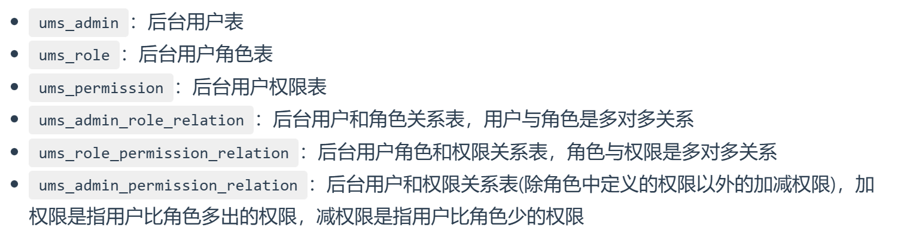
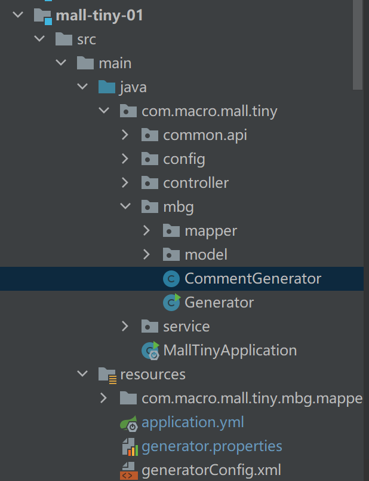
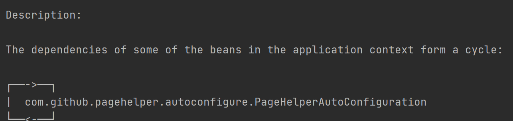

# mall-security认证模块



# mall-tiny-01-mybatis



## 问题1：pagehelper版本过低，与springboot版本不匹配导致启动失败

pagehelper依赖循环导致



已解决：在application.yml加上允许循环依赖

```yml
spring:
  main:
    allow-circular-references: true
```

## 用mybatis-generator生成mapper和实体类

addRemarkComments是生成器中的一个属性，true则用数据库中字段的注释，false则用默认的注释生成

1.Generator是代码生成的启动器

2.generatorConfig.xml是启动器的配置文件

3.generator.properties是配置文件的仓库，配置文件从中提取数据库的连接和密码

4.CommentGenerator是自定义的注释生成器，放在2中。

## MyBatis配置类

MyBatisConfig必须为这个名字，约定大于配置，bean的名字需要与约定的相同。

## ResultCode枚举类

ResultCode实现了IErrorCode接口，可以不实现，可能是为了后面多态扩展而实现的。

## 问题2：@Autowired一个Mapper时报红

已解决：

1.改成@Resource

2.在对应的Mapper上加上@Mapper

## insert和insertSelective的区别

[insert和insertSelective的区别_lock your heart的博客-CSDN博客_insert和insertselective](https://blog.csdn.net/qq_35648761/article/details/120416316)

Mapper中后缀Example是带条件的

## 问题3：缺少bean启动不了application

```Java
org.springframework.beans.factory.BeanCreationException: Error creating bean with name 'com.macro.mall.tiny.MallTiny01ApplicationTests': Injection of resource dependencies failed;
```

bean没注入进来容器中，一般是没@Mapper或者没加@Service等bean注解

## Mapper是怎么知道PageHelper设置的page信息

[ 关于mapper和pagehelper的使用发现_孤竹彧的博客-CSDN博客_pagehelper mapper](https://blog.csdn.net/qq_33321609/article/details/112610699)

# mall-tiny-02-swagger

## Swagger2用法

- @Api：用于修饰Controller类，生成Controller相关文档信息
- @ApiOperation：用于修饰Controller类中的方法，生成接口方法相关文档信息
- @ApiParam：用于修饰接口中的参数，生成接口参数相关文档信息
- @ApiModelProperty：用于修饰实体类的属性，当实体类是请求参数或返回结果时，直接生成相关文档信息

## 问题1：springboot版本与Swagger版本不兼容导致的bug

```java
Failed to start bean 'documentationPluginsBootstrapper'; nested exception is java.lang.NullPointerException
```

[ 解决方案之‘Failed to start bean ‘documentationPluginsBootstrapper‘； nested exception is java.lang.NullPoi_技术宅星云的博客-CSDN博客](https://blog.csdn.net/hadues/article/details/123753888)

[集成swagger3.0，Failed to start bean ‘documentat‘,@EnableMvc坑点_只会写bug的靓仔的博客-CSDN博客](https://blog.csdn.net/faker1234546/article/details/125232373)

在application.yml中添加

```yml
spring:
  mvc:
    pathmatch:
      matching-strategy: ANT_PATH_MATCHER
```

## 问题2：Swagger的访问地址

swagger3的访问地址为：http://localhost:8080/swagger-ui/index.html

swagger3之前版本的访问地址为：http://localhost:8080/swagger-ui.html

8080是项目的端口号

[ swagger3.0访问后台地址_vpvu的博客-CSDN博客_swaager的后台地址](https://blog.csdn.net/qq_44123650/article/details/108352412)

swagger3.0只用导一个依赖即可，之前需要两个

在swagger的配置类上加@EnableOpenApi，之前为@EnableSwagger2

[全新Swagger3.0教程，OAS3快速配置指南，实现API接口文档自动化！_无敌路路帅气的博客-CSDN博客_oas3](https://blog.csdn.net/m0_59562547/article/details/118933734)

# mall-tiny-03-redis

## @Value

取application.yml文件里的属性：@Value（“${路径名}”）

## 验证码

把前缀+电话号码作为key

验证码作为value

存入redis中

## Random

Random.nextInt（n）产生[0,n)范围的随机整数

## Redis命令

进入redis库：redis-cli 

set key value

get key

检查给定的key是否存在：exists key

为key设置过期时间：expire key seconds

以秒为单位，返回给定key的剩余生存时间：ttl key

[ 超全Redis命令总结，墙裂建议收藏，说不定就用上了呢_欧子有话说的博客-CSDN博客](https://blog.csdn.net/Candyz7/article/details/126830186)

# mall-tiny-04

## SpringSecurity和Jwt实现认证和授权

基本思路：

1.JwtTokenUtil工具类用于Jwt的各种操作。

2.SecurityConfig是SpringSecurity的配置类，有拦截utl、配置处理器、配置加密、获取用户信息、配置过滤器等功能

装配在配置类中，但需要自己实现的类

3.RestfulAccessDeniedHandler没有权限时的处理器

4.RestAuthenticationEntryPoint未登录或者token失效时的处理器

5.JwtAuthenticationTokenFilter过滤器，